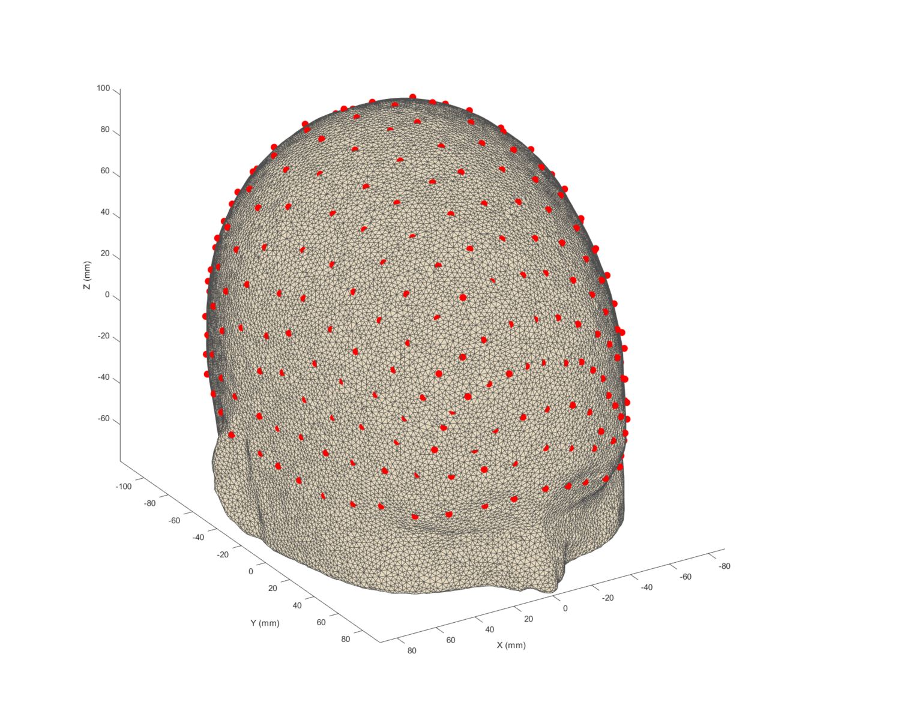
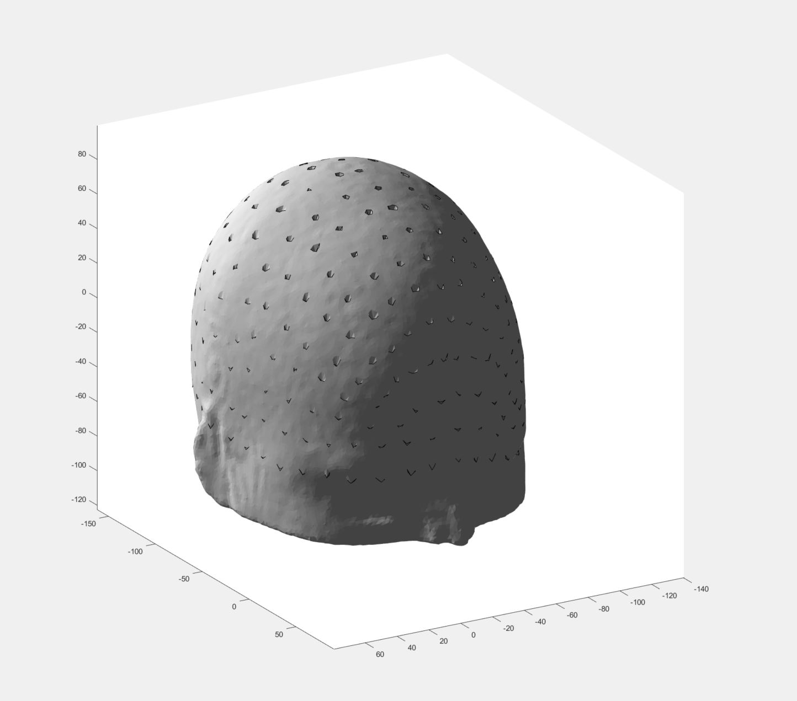

# MNI152 3D template in STL format

Script to create a 3D model of the ICBM MNI152 template in stereolithography (STL) format with 10-5 EEG points, using the [DOT-HUB toolbox](https://github.com/DOT-HUB/DOT-HUB_toolbox).

This can be used for 3D printing offline templates to be used in, for example, [STORM-NET](https://github.com/yoterel/STORM-Net) or other photogrammetry methods for anatomical registration of EEG electrodes and/or fNIRS optodes.

This script just converts already created templates. The template is created by the UCL DOT-HUB team, in particular Brigadoi et al., see the following articles:

Brigadoi, S., Powell, S., Cooper, R. J., Dempsey, L. A., Arridge, S., Everdell, N., ... & Gibson, A. P. (2015). Evaluating real-time image reconstruction in diffuse optical tomography using physiologically realistic test data. Biomedical Optics Express, 6(12), 4719-4737. https://doi.org/10.1364/BOE.6.004719

Mazzonetto, I., Castellaro, M., Cooper, R. J., & Brigadoi, S. (2022). Smartphone-based photogrammetry provides improved localization and registration of scalp-mounted neuroimaging sensors, Sci. Rep. 12 (1)(2022) 10862. https://doi.org/10.1038/s41598-022-14458-6

Prerequisites:

- [DOT-HUB toolbox](https://github.com/DOT-HUB/DOT-HUB_toolbox)
- [interparc MATLAB function](https://se.mathworks.com/matlabcentral/fileexchange/34874-interparc)
- [AtlasViewer](https://github.com/BUNPC/AtlasViewer) or [Homer2](https://www.nitrc.org/projects/homer2/) in MATLAB path

Running:

- Place the DOT-HUB [AdultMNI152.mshs](https://github.com/DOT-HUB/DOT-HUB_toolbox/tree/master/ExampleMeshes) mesh in the folder
- Run the script!

You should get a 3D model of the scalp mesh with indents at the 10-5 points.

